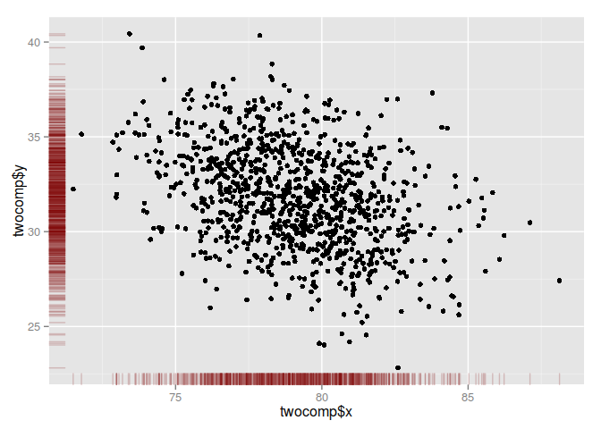
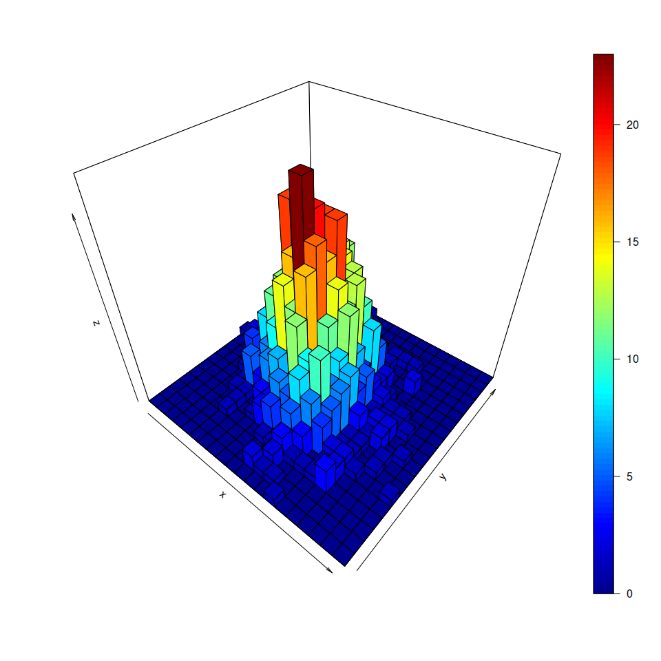

# Многомерное нормальное распределение

## Многомерное нормальное распределение.

### 1. Изучить функцию, позволяющую получать многомерные нормально распределенные выборки $Х = (х_1, \dots, х_N), N >= 3$

Define function for generating a random positive-definite matrix with user-specified positive eigenvalues. If eigenvalues are not specified, they are generated from a uniform distribution.

```r
PDmatrix <- function (n, ev = runif(n, 0, 10)) {
  Z <- matrix(ncol=n, rnorm(n^2))
  decomp <- qr(Z)
  Q <- qr.Q(decomp) 
  R <- qr.R(decomp)
  d <- diag(R)
  ph <- d / abs(d)
  O <- Q %*% diag(ph)
  Z <- t(O) %*% diag(ev) %*% O
  return(Z)
}
```

Initialize variables

```r
N <- 10^3
mu <- runif(3, 0, 100)
sigma <- PDmatrix(3)

print(mu)
```

```
## [1] 92.40541 24.09545 65.85482
```

```r
print(sigma)
```

```
##            [,1]       [,2]       [,3]
## [1,]  7.0236689 -0.3808977  1.7343992
## [2,] -0.3808977  5.8483066 -0.4112306
## [3,]  1.7343992 -0.4112306  7.4234090
```

Generate multidimensional sample with init values

```r
library(MASS)
mnorm <- mvrnorm(N, mu, sigma)

head(mnorm)
```

```
##          [,1]     [,2]     [,3]
## [1,] 93.38579 25.52743 69.82337
## [2,] 94.08772 25.43773 68.11961
## [3,] 91.49862 26.13953 62.60593
## [4,] 92.55027 24.18130 63.51404
## [5,] 93.36562 24.48766 64.55311
## [6,] 98.85880 26.94756 65.54169
```

### 2. Выделить две компоненты и построить график соответствующей плотности (маргинальной);
2d:

```r
library(ggplot2)

twocomp <- data.frame(x = mnorm[, 1], y = mnorm[, 2])

ggplot(twocomp, aes(x = twocomp$x, y = twocomp$y)) + geom_point() + 
    geom_rug(col=rgb(.5,0,0,alpha=.2))
```

 

3d:

```r
library(sm)
```

```
## Package 'sm', version 2.2-5.4: type help(sm) for summary information
## 
## Attaching package: 'sm'
## 
## The following object is masked from 'package:MASS':
## 
##     muscle
```

```r
# sm.density(twocomp, display="rgl")
sm.density(twocomp)
```

```
## Warning: weights overwritten by binning
```

```
## Loading required package: rgl
## Loading required package: rpanel
## Loading required package: tcltk
## Package `rpanel', version 1.1-3: type help(rpanel) for summary information
```

 
### 3. Выделить три компоненты и построить диаграмму рассеивания scatter diagram (оси Ох1, Ох2, Ох3);

```r
library(scatterplot3d)

# plot3d(mnorm)
scatterplot3d(mnorm, highlight.3d = TRUE, pch = 20)
```

 

### 4. Оценить параметры норм распределения, например, по формулам из лекции;
Expeсted value

```r
mean(mnorm[, 1])
```

```
## [1] 92.47606
```

Variance

```r
var(mnorm[, 1])
```

```
## [1] 7.13318
```

### 5. Сгенерировать выборку из многомерного РВ, отличного от нормального;

```r
mnotnorm <- log(mnorm^c(1, 2, 3))
head(mnotnorm)
```

```
##           [,1]     [,2]      [,3]
## [1,]  4.536739 6.479507 12.737906
## [2,]  9.088455 9.708701  4.221265
## [3,] 13.548972 3.263449  8.273720
## [4,]  4.527752 6.371159 12.453783
## [5,]  9.073046 9.594509  4.167488
## [6,] 13.781078 3.293893  8.365373
```

### 6. Выделить две компоненты и построить соответсвующую гистограмму (убедиться в ненормальности);

2d:

```r
twocomp <- data.frame(x = sample(mnotnorm[, 1]), y = sample(mnotnorm[, 2]))

ggplot(twocomp, aes(x = twocomp$x, y = twocomp$y)) + geom_point() + 
    geom_rug(col=rgb(.5,0,0,alpha=.2))
```

 

3d:

```r
# sm.density(twocomp, display="rgl")
sm.density(twocomp)
```

 

### 7. Для нормальной выборки выбрать 2 компоненты, отличные от первой и вычислить множественный коэф. корреляциии 1-й комп. и выбранных
By formula $$R_{z, xy} = \sqrt{\frac{r_{xz}^2 + r_{yz}^2 - 2 r_{yz} r_{xz} r_{xy}}{1 - r_{xy}^2}}$$ where `z` -- first component.

```r
mcor <- function(d, x, y, z = 1) {
  r_xy <- cor(d[, x], d[, y])
  r_xz <- cor(d[, x], d[, z])
  r_yz <- cor(d[, y], d[, z])
  
  sqrt((r_xz^2 + r_yz^2 - 2 * r_yz * r_xz * r_xy) / (1 - r_xy^2))
}
```

Multiple correlation coefficent:

```r
mcor(mnorm, 2, 3)
```

```
## [1] 0.2751376
```
